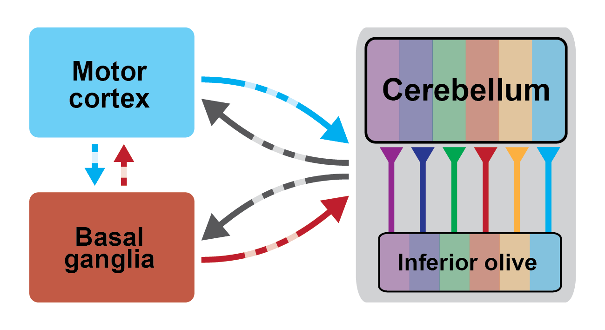

They are the lab's first two graduate students.

Their projects will investigate how cerebellar output influences dynamics in the forebrain during goal-directed behaviour. Carolina will focus on cerebellum-basal ganglia interactions, and Subham will focus on cerebello-cortical interactions.

<!--more-->