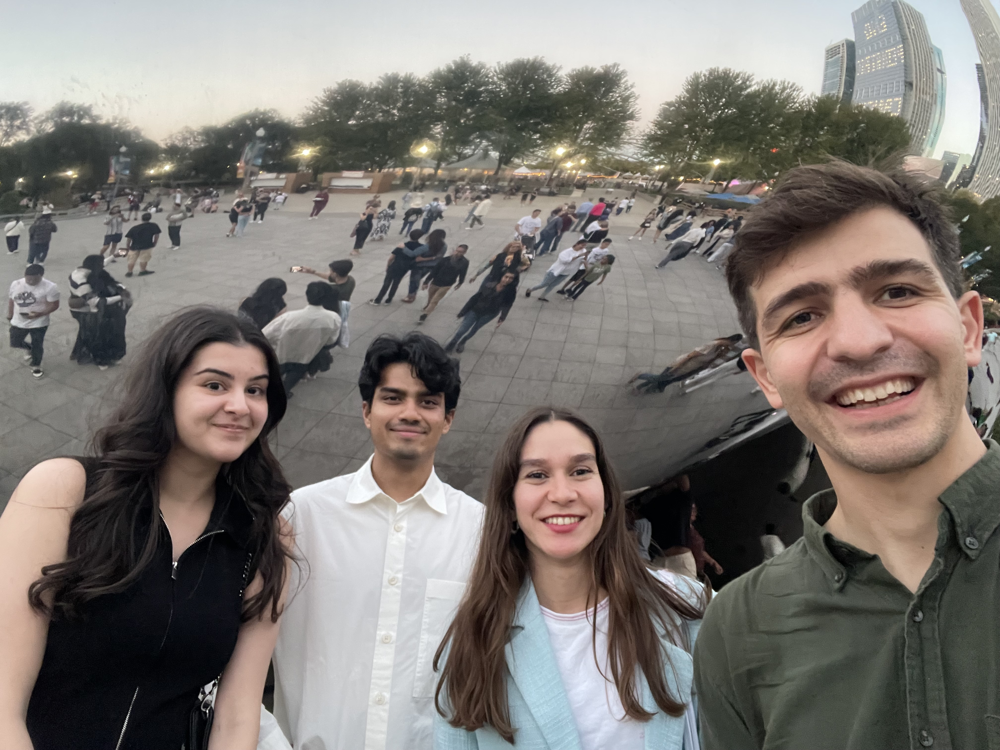
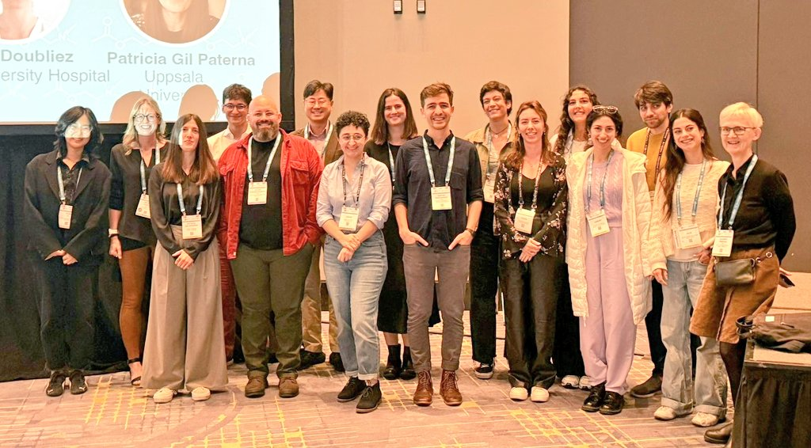
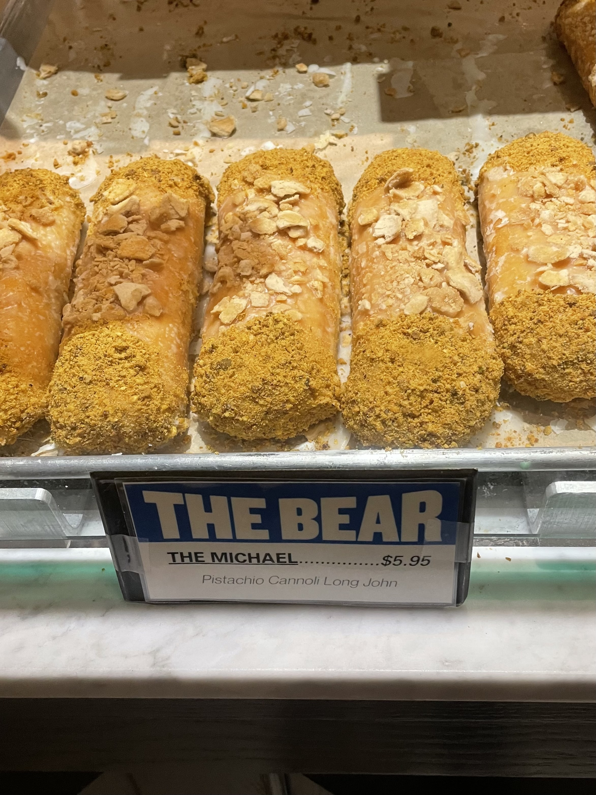

Dimitar gave a talk at the **Cerebellar Predictive Encoding in Health and Disease** [Minisymposium](https://www.abstractsonline.com/pp8/#!/20433/session/97).

The lab in front of the bean

Minisymposium speaker photo with organizers

Chicago food: Billy Goat Tavern, Gino's East, and The Bear donuts

<!--more-->