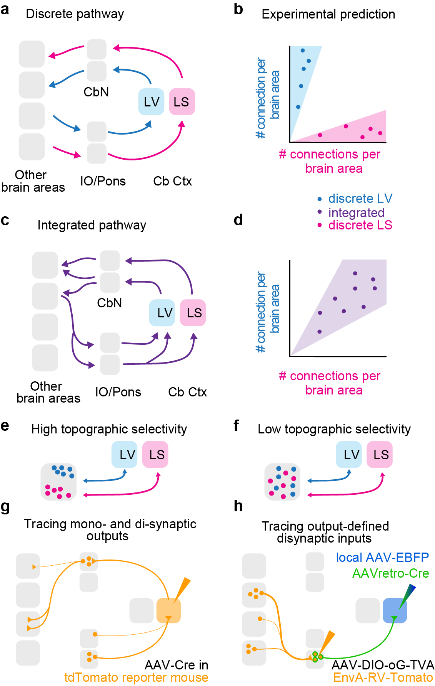

In this [study](/publication/2026-clothier-biorxiv/), we compare the long-range connections formed between cerebellar Lobules V and simplex and the forebrain.

We find that long-range connections are organized at the level of subcircuits rather than whole brain regions, reveal the organization logical of cerebellar connections with their forebrain partner regions.

