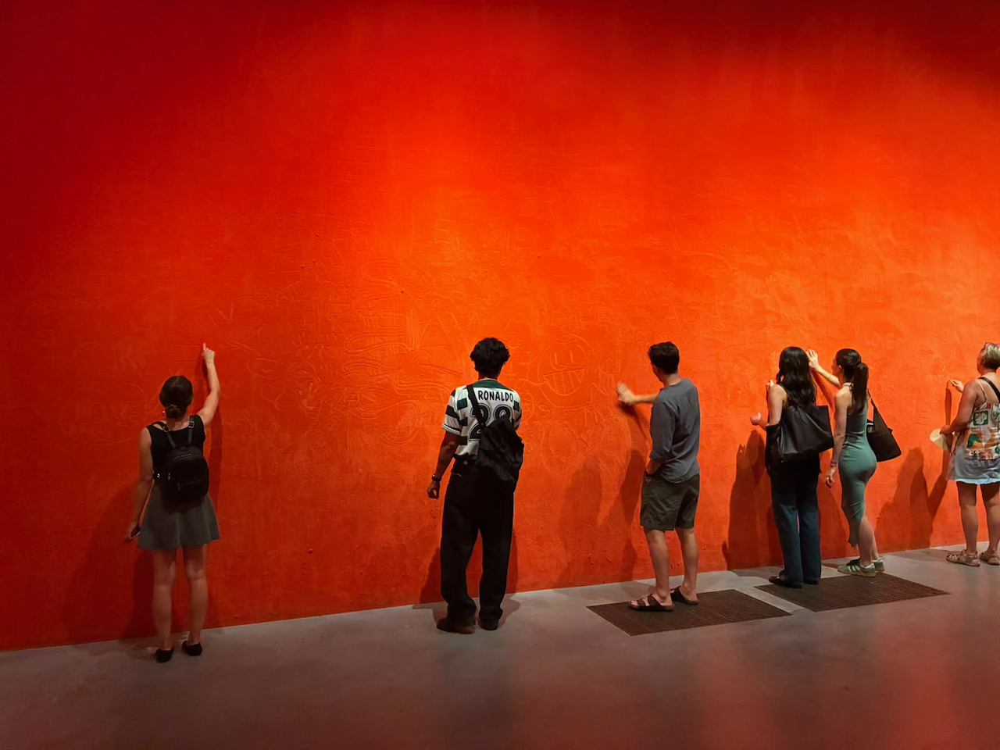
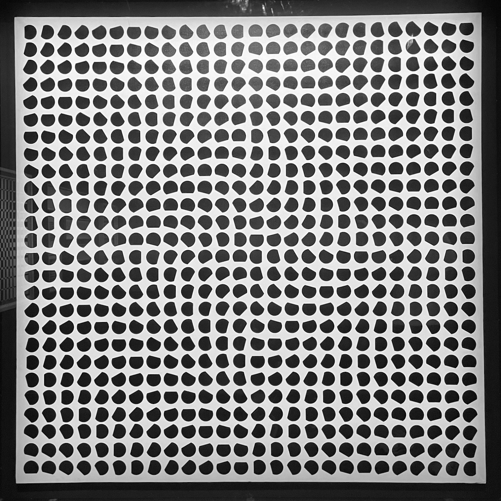

After Ren's internal seminar, we spent the afternoon at Tate Modern. We saw the Julio le Parc exhibition and also strolled the main galleries. The shaggy orange carpet wall was a consensus favorite.

Some serious higher visual area engagement in the Julio le Parc