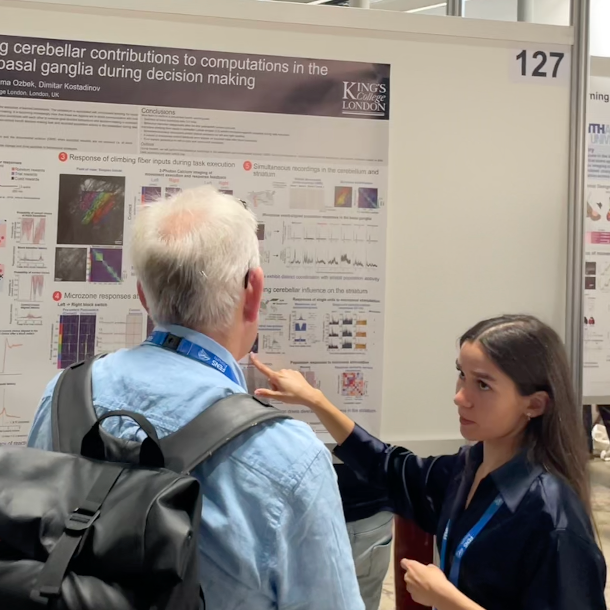
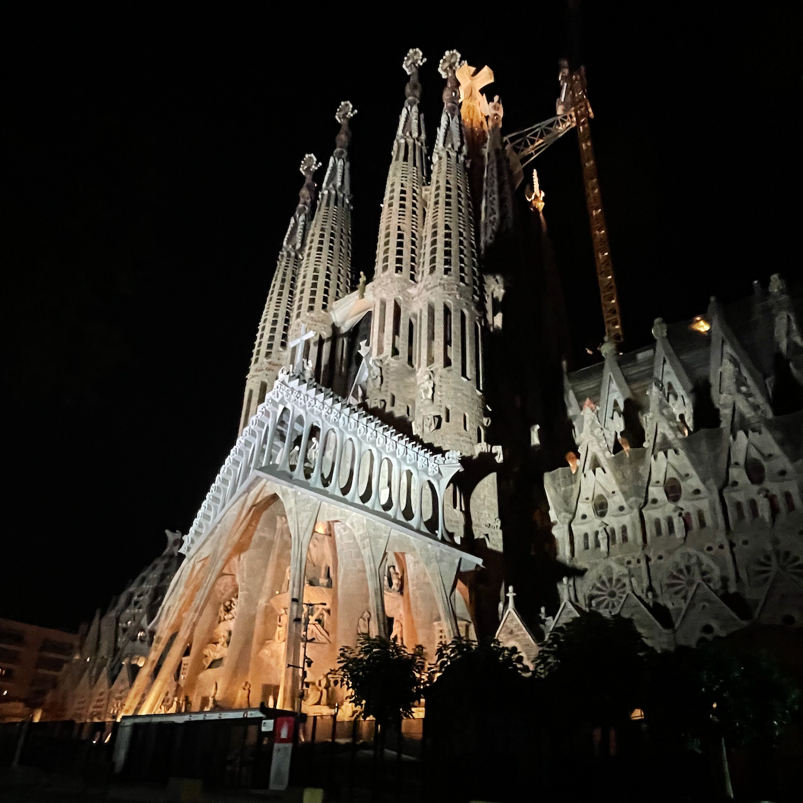

Carolina presented a poster on her PhD work interrogating cerebellum-basal ganglia interactions. The poster was notable for its scientific brilliance, aesthetic qualities, and high attendance.

La Sagrada Familia at night